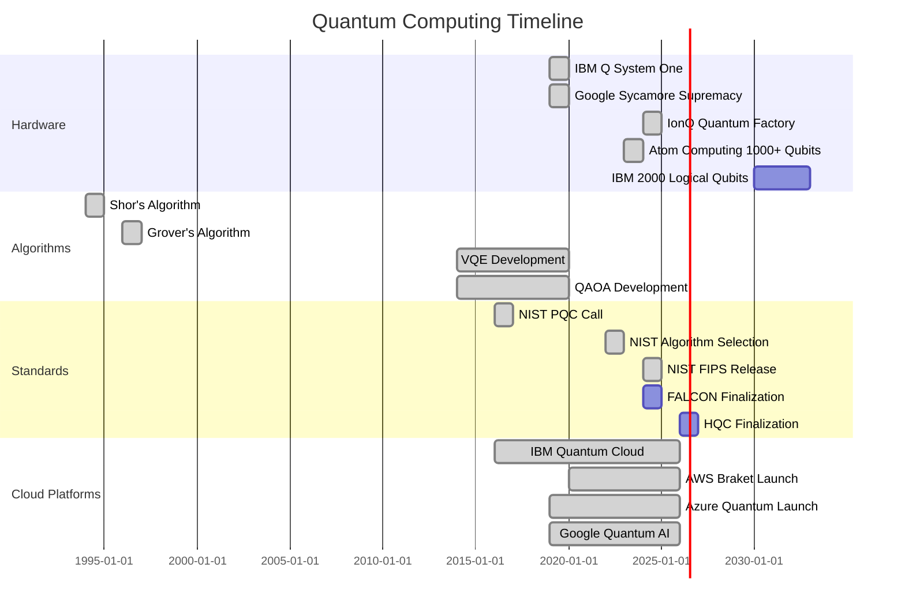

# Quantum Computing - Comprehensive Reference Guide

> A curated collection of quantum computing resources, frameworks, cloud platforms, algorithms, hardware providers, academic research, and industry applications.

---

## 📋 Table of Contents

- [Overview](#overview)
- [Quantum Computing Frameworks](#quantum-computing-frameworks)
- [Cloud Platforms](#cloud-platforms)
- [Quantum Hardware Providers](#quantum-hardware-providers)
- [Quantum Algorithms](#quantum-algorithms)
- [GitHub Repositories](#github-repositories)
- [Academic Research](#academic-research)
- [Educational Resources](#educational-resources)
- [Applications](#applications)
- [Post-Quantum Cryptography](#post-quantum-cryptography)
- [Timeline \& Roadmap](#timeline--roadmap)

---

## Overview

Quantum computing harnesses quantum mechanical phenomena such as **superposition** and **entanglement** to perform computations that are intractable for classical computers. The field is rapidly advancing from theoretical research to practical applications across multiple domains.

**Key Quantum Phenomena:**
- 🌀 **Superposition** - Qubits exist in multiple states simultaneously
- 🔗 **Entanglement** - Quantum states become correlated across qubits
- 📊 **Interference** - Amplifying correct answers while canceling wrong ones

**Current Era:** NISQ (Noisy Intermediate-Scale Quantum) - 50-1000+ qubits with limited coherence

---

## Quantum Computing Frameworks

### Qiskit (IBM)
**Repository:** [github.com/Qiskit/qiskit](https://github.com/Qiskit/qiskit)

Open-source SDK for working with quantum computers at the level of circuits, operators, and primitives.

**Features:**
- Circuit building and optimization
- Sampler and Estimator primitives
- Transpiler for circuit optimization
- Integration with IBM Quantum Platform

**Community Projects:**
- [Qiskit Machine Learning](https://github.com/qiskit-community/qiskit-machine-learning)
- [Qiskit Nature](https://github.com/qiskit-community/qiskit-nature) - Quantum mechanical natural science problems

### Cirq (Google Quantum AI)
**Repository:** [github.com/quantumlib/Cirq](https://github.com/quantumlib/Cirq)

Python framework for creating, editing, and invoking quantum circuits on NISQ computers.

**Features:**
- Flexible gate definitions
- Parameterized circuits
- Circuit transformation
- Hardware device modeling
- Native support for Google quantum processors

**Related:**
- [ReCirq](https://github.com/quantumlib/ReCirq) - Research code and experiments

### PennyLane (Xanadu)
**Repository:** [github.com/PennyLaneAI/pennylane](https://github.com/PennyLaneAI/pennylane)

Cross-platform library for differentiable programming of quantum computers, quantum machine learning, and quantum chemistry.

**Features:**
- Quantum-classical hybrid workflows
- Automatic differentiation
- Integration with TensorFlow, PyTorch, JAX
- Plugin ecosystem (Lightning, Qiskit, Cirq)

**Plugins:**
- `pennylane-lightning` - Fast state-vector simulators
- `pennylane-qiskit` - Qiskit integration

---

## Cloud Platforms

### IBM Quantum Platform
**Website:** [quantum.ibm.com](https://quantum.ibm.com)

**Hardware:** Superconducting transmon qubits  
**Access:** Public and premium cloud access  
**Framework:** Qiskit

**Key Features:**
- IBM Quantum Composer (graphical interface)
- Suite of quantum processors
- Enterprise-first approach
- Roadmap: 2,000 logical qubits by 2033

**Notable Systems:**
- IBM Q System One (2019) - First commercial quantum computer

### Google Quantum AI
**Website:** [quantumai.google](https://quantumai.google)

**Hardware:** Superconducting qubits  
**Framework:** Cirq  
**Access:** Google Cloud Platform

**Achievements:**
- **Sycamore (2019):** Quantum advantage demonstration (200 seconds vs 10,000 years)
- **Willow (2024):** First verifiable quantum advantage with improved error correction

**Focus Areas:**
- Large-scale error-corrected quantum computers
- Novel chip architectures
- Quantum algorithm research

### Microsoft Azure Quantum
**Website:** [azure.microsoft.com/quantum](https://azure.microsoft.com/quantum)

**Approach:** Open, flexible, hardware-agnostic platform

**Hardware Partners:**
- Quantinuum (trapped-ion)
- IonQ (trapped-ion)
- Atom Computing (neutral atom)

**Software:**
- **Q#** quantum programming language
- Quantum Development Kit (QDK)
- Support for Qiskit, Cirq, OpenQASM

**Special Platforms:**
- **Azure Quantum Elements** - AI + HPC + quantum for molecular simulations

**Microsoft Research:**
- Topological quantum computing (error-resistant qubits)

### AWS Braket
**Website:** [aws.amazon.com/braket](https://aws.amazon.com/braket)

**Model:** Aggregator platform - single access point to multiple quantum hardware providers

**Hardware Options:**
- **Ion Trap:** IonQ, AQT
- **Superconducting:** IQM, Rigetti
- **Neutral Atom:** QuEra Computing

**Features:**
- Managed Jupyter notebooks
- Modular Python SDK
- Hybrid quantum-classical workflows
- Integration with AWS services

---

## Quantum Hardware Providers

### IonQ
**Technology:** Trapped-ion (Ytterbium ions)  
**Website:** [ionq.com](https://ionq.com)

**Key Features:**
- All-to-all qubit connectivity
- Laser-based operations (preparation, gates, readout)
- Cloud access via AWS, Azure, Google Cloud
- Dedicated quantum factory (2024)

### Rigetti Computing
**Technology:** Superconducting quantum integrated circuits  
**Website:** [rigetti.com](https://rigetti.com)

**Approach:** Full-stack quantum computing

**Capabilities:**
- In-house chip design and fabrication
- Forest platform (Quantum Instruction Language - Quil)
- Rigetti Quantum Cloud Services
- **Novera** - On-premises QPU

### QuEra Computing
**Technology:** Neutral-atom quantum computers  
**Website:** [quera.com](https://quera.com)

**Origins:** Harvard University + MIT research

**Specifications:**
- Up to 256 qubits (Aquila-class)
- Field-Programmable Qubit Arrays (FPQA™)
- Room temperature operation (no cryogenic cooling)
- Low energy consumption

**Access:** Cloud (Amazon Braket) + on-premises

### Atom Computing
**Technology:** Optically trapped neutral atoms  
**Website:** [atom-computing.com](https://atom-computing.com)

**Achievements:**
- First universal quantum platform >1,000 qubits (1,180-qubit prototype, 2023)
- **AC1000:** 1,200+ physical qubits

**Features:**
- 40-second coherence times
- All-to-all connectivity
- Mid-circuit measurement with qubit reuse

---

## Quantum Algorithms

### Shor's Algorithm (1994)
**Developer:** Peter Shor  
**Purpose:** Integer factorization

**Significance:**
- Exponentially faster than classical algorithms
- Threatens RSA cryptography
- Uses quantum Fourier transform

**Impact:** Motivated post-quantum cryptography research

### Grover's Algorithm (1996)
**Developer:** Lov Grover  
**Purpose:** Unstructured search

**Speedup:** Quadratic (√N vs N queries)

**Mechanism:**
- Amplitude amplification
- Reflection on the mean
- Inversion of marked state

**Applications:** Database search, optimization problems

### Variational Quantum Eigensolver (VQE)
**Type:** Hybrid quantum-classical algorithm  
**Suited for:** NISQ devices

**Purpose:** Find ground state energy of quantum systems

**Applications:**
- Quantum chemistry
- Materials science
- Drug discovery

**Process:**
1. Quantum computer prepares parameterized state (ansatz)
2. Measures expectation value
3. Classical optimizer adjusts parameters
4. Iterates to minimize energy

### Quantum Approximate Optimization Algorithm (QAOA)
**Type:** Hybrid quantum-classical algorithm  
**Purpose:** Combinatorial optimization

**Target:** NP-hard problems

**Mechanism:**
- Parameterized quantum circuit
- Alternating problem/mixing Hamiltonians
- Classical optimization of parameters

**Applications:**
- Logistics optimization
- Portfolio optimization
- Supply chain management

---

## GitHub Repositories

### Awesome Lists
- **[awesome-quantum-computing](https://github.com/desireevl/awesome-quantum-computing)** - Curated list of quantum computing resources
- **[awesome-quantum-machine-learning](https://github.com/krishnakumarsekar/awesome-quantum-machine-learning)**

### Frameworks & Tools
- **[Qiskit](https://github.com/Qiskit/qiskit)** - IBM's quantum SDK
- **[Cirq](https://github.com/quantumlib/Cirq)** - Google's quantum framework
- **[PennyLane](https://github.com/PennyLaneAI/pennylane)** - Differentiable quantum programming
- **[ProjectQ](https://github.com/ProjectQ-Framework/ProjectQ)** - Open-source quantum compiler
- **[Strawberry Fields](https://github.com/XanaduAI/strawberryfields)** - Photonic quantum computing

### Simulators
- **[QuTiP](https://github.com/qutip/qutip)** - Quantum Toolbox in Python
- **[pyQuil](https://github.com/rigetti/pyquil)** - Rigetti's Python library
- **[Qulacs](https://github.com/qulacs/qulacs)** - Fast quantum circuit simulator

### Quantum Machine Learning
- **[TensorFlow Quantum](https://github.com/tensorflow/quantum)** - TensorFlow integration
- **[Qiskit Machine Learning](https://github.com/qiskit-community/qiskit-machine-learning)**

---

## Academic Research

### Quantum Supremacy & Advantage

**Landmark Papers:**
- **Google Sycamore (2019)** - *Nature*: Quantum supremacy demonstration
- **USTC Jiuzhang (2020)** - Gaussian boson sampling on 76 photons
- **University of Texas (2025)** - Unconditional separation (arXiv preprint)

### Error Correction
- **Google Willow (2024)** - Logical qubit with lower error rate than physical qubits
- **Harvard (2025)** - *Nature*: 3,000-qubit computer with new error correction

### arXiv Quantum Computing Papers
- Quantum computing overviews and vision
- Quantum-classical hybrid systems
- Quantum AI integration
- Hardware and software development

**Key Topics:**
- Fault-tolerant quantum computing
- Topological quantum computing
- Quantum annealing
- Variational quantum algorithms

---

## Educational Resources

### YouTube Channels

**MIT OpenCourseWare:**
- Introduction to Quantum Computing (Prof. Will Oliver)
- MIT 6.S965 - Quantum Computing Basics
- MIT 8.04 Quantum Physics I (Prof. Allan Adams)
- Quantum Computing Fundamentals

**Stanford:**
- Stanford Quantum Initiative (SQCA)
- Modern Physics: Quantum Mechanics (Leonard Susskind)
- Quantum Computing Applications (Prof. Jelena Vuckovic)

**Industry:**
- **Qiskit** - Hands-on quantum programming
- **IBM Research** - Beginner's Guide to Quantum Computing
- **Google Quantum AI** - Research updates and tutorials

**Community:**
- **Quantum Soar** - Basic quantum algorithms
- **QCTheory** - Quantum theory fundamentals
- **Quantum Sense** - Clear explanations (Hilbert Space, etc.)

**Universities:**
- UCL Quantum Science and Technology Institute
- University of Waterloo (Richard Cleve)
- Oxford (Artur Ekert)
- John Watrous (IBM) - Fault tolerance lectures

**Research Institutions:**
- Quanta Magazine
- The Quantum Insider
- Simons Institute
- QuTech Academy
- Munich Center for Quantum Science & Technology

---

## Applications

### Drug Discovery & Healthcare

**Capabilities:**
- Molecular simulation and interaction analysis
- Accelerated drug screening
- Protein folding and geometry modeling
- Personalized medicine
- Chemical reaction optimization

**Benefits:**
- Faster, more precise predictions
- Reduced time and cost
- Targeted drug design
- Better understanding of biological systems

### Optimization

**Problem Types:**
- Logistics and routing
- Supply chain management
- Portfolio optimization
- Resource allocation
- Scheduling

**Advantages:**
- Evaluate multiple possibilities simultaneously
- Solve previously intractable problems
- Faster solutions than classical methods

**Algorithms:** QAOA, quantum annealing

### Finance

**Applications:**

**Portfolio Optimization:**
- Maximize returns while minimizing risk
- Analyze massive financial datasets
- Efficient asset allocation

**Risk Management:**
- Enhanced risk profiling
- Precise market simulations
- Credit scoring
- Real-time risk assessment
- Fraud detection

**Financial Modeling:**
- Faster Monte Carlo simulations
- Comprehensive probabilistic analysis
- Better predictive analytics
- Reduced uncertainty

**High-Frequency Trading:**
- Market pattern analysis
- Ultra-fast trade execution

**Quantum Machine Learning (QML):**
- Generative modeling
- Fraud detection
- Churn prediction
- Synthetic data generation

### Materials Science
- Molecular dynamics simulation
- New materials discovery
- Catalyst design
- Battery optimization

### Climate Modeling
- Weather prediction
- Climate change simulation
- Carbon capture optimization

---

## Post-Quantum Cryptography

### NIST Standardization Initiative

**Timeline:**
- **2016:** Public call for proposals
- **2017:** 69 submissions received
- **2022:** Four algorithms selected
- **August 2024:** First three FIPS standards released

### NIST-Approved Algorithms (2024)

#### ML-KEM (Module-Lattice-Based Key-Encapsulation Mechanism)
**Formerly:** CRYSTALS-Kyber

**Purpose:** General encryption  
**Advantages:** Small encryption keys, fast operation  
**Use Cases:** Website access, secure communications

#### ML-DSA (Module-Lattice-Based Digital Signature Algorithm)
**Formerly:** CRYSTALS-Dilithium

**Purpose:** Digital signatures  
**Function:** Authenticity and integrity of digital communications

#### SLH-DSA (Stateless Hash-Based Digital Signature Algorithm)
**Formerly:** SPHINCS+

**Purpose:** Backup digital signature standard  
**Approach:** Different mathematical foundation than ML-DSA

### Future Standards

**FALCON (FN-DSA):**
- Digital signature algorithm
- Expected finalization: Late 2024

**HQC (Hamming Quasi-Cyclic):**
- Code-based scheme
- Backup for ML-KEM
- Draft standard: Early 2026
- Finalization: 2027

### Mathematical Foundations
- Lattice-based cryptography
- Hash-based cryptography
- Code-based cryptography

**Security:** Resistant to both classical and quantum attacks

**Urgency:** Protection against "harvest now, decrypt later" attacks

---

## Timeline & Roadmap

**Key Milestones:**
- ✅ **1994**: Shor's algorithm published
- ✅ **1996**: Grover's algorithm published
- ✅ **2016**: IBM Quantum cloud access launched
- ✅ **2019**: Google quantum supremacy claim
- ✅ **2019**: IBM Q System One (first commercial quantum computer)
- ✅ **2023**: Atom Computing >1,000 qubits
- ✅ **2024**: NIST post-quantum cryptography standards released
- ✅ **2024**: Google Willow chip (improved error correction)
- 📅 **2027**: HQC post-quantum standard finalized
- 📅 **2030s**: Fault-tolerant quantum computers expected
- 📅 **2033**: IBM 2,000 logical qubits target

---

## Quantum Computing Technologies

| Technology | Providers | Advantages | Challenges |
|------------|-----------|------------|------------|
| **Superconducting** | IBM, Google, Rigetti | Fast gates, mature technology | Requires cryogenic cooling |
| **Trapped Ion** | IonQ, Quantinuum | Long coherence, high fidelity | Slower gates |
| **Neutral Atom** | QuEra, Atom Computing | Scalability, room temperature | Developing technology |
| **Photonic** | Xanadu, PsiQuantum | Room temperature, networking | Challenging to scale |
| **Topological** | Microsoft (research) | Inherent error resistance | Still in research phase |

---

## Getting Started

### For Developers

1. **Choose a framework:** Qiskit, Cirq, or PennyLane
2. **Access cloud platforms:** IBM Quantum, AWS Braket, or Azure Quantum
3. **Learn quantum algorithms:** Start with Grover's and VQE
4. **Explore tutorials:** MIT OCW, Qiskit tutorials, PennyLane demos

### For Researchers

1. **Study quantum mechanics fundamentals**
2. **Explore arXiv quantum computing papers**
3. **Join research consortiums**
4. **Contribute to open-source projects**

### For Enterprises

1. **Identify use cases:** Optimization, simulation, ML
2. **Pilot projects:** Start with NISQ algorithms (VQE, QAOA)
3. **Prepare for post-quantum cryptography**
4. **Partner with quantum cloud providers**

---

## Contributing

This is a living document. To suggest additions or corrections:
1. Fork the repository
2. Create a feature branch
3. Submit a pull request with references

---

## License

This reference guide is provided for educational and research purposes. All linked resources are property of their respective owners.

---

**Last Updated**: January 2026

**Maintained by**: [@nbajpai-code](https://github.com/nbajpai-code)
