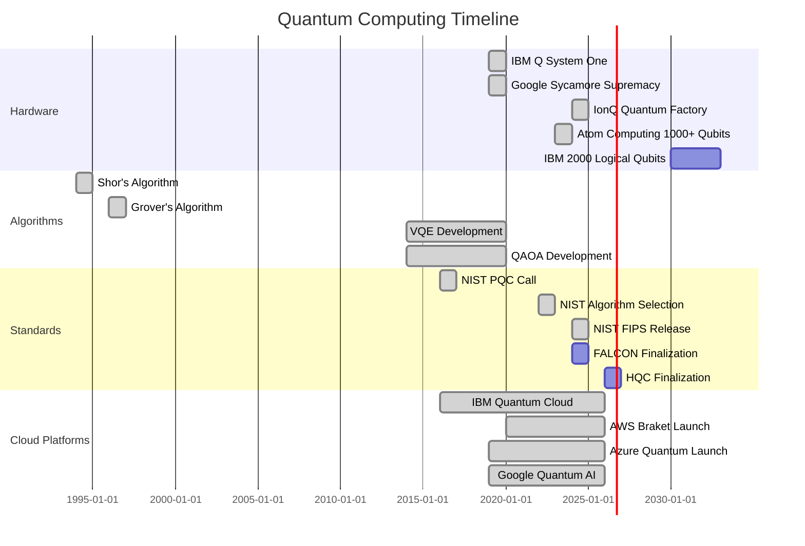

# Quantum Computing - Comprehensive Reference Guide

> A curated collection of quantum computing resources, frameworks, cloud platforms, algorithms, hardware providers, academic research, and industry applications.

---

## 📋 Table of Contents

- [Overview](#overview)
- [Quantum Computing Frameworks](#quantum-computing-frameworks)
- [Cloud Platforms](#cloud-platforms)
- [Quantum Hardware Providers](#quantum-hardware-providers)
- [Quantum Algorithms](#quantum-algorithms)
- [GitHub Repositories](#github-repositories)
- [Academic Research](#academic-research)
- [Educational Resources](#educational-resources)
- [Applications](#applications)
- [Post-Quantum Cryptography](#post-quantum-cryptography)
- [Timeline \& Roadmap](#timeline--roadmap)

---

## Overview

Quantum computing harnesses quantum mechanical phenomena such as **superposition** and **entanglement** to perform computations that are intractable for classical computers. The field is rapidly advancing from theoretical research to practical applications across multiple domains.

**Key Quantum Phenomena:**
- 🌀 **Superposition** - Qubits exist in multiple states simultaneously
- 🔗 **Entanglement** - Quantum states become correlated across qubits
- 📊 **Interference** - Amplifying correct answers while canceling wrong ones

**Current Era:** NISQ (Noisy Intermediate-Scale Quantum) - 50-1000+ qubits with limited coherence

---

## Quantum Computing Frameworks

### Qiskit (IBM)
**Repository:** [github.com/Qiskit/qiskit](https://github.com/Qiskit/qiskit)

Open-source SDK for working with quantum computers at the level of circuits, operators, and primitives.

**Features:**
- Circuit building and optimization
- Sampler and Estimator primitives
- Transpiler for circuit optimization
- Integration with IBM Quantum Platform

**Community Projects:**
- [Qiskit Machine Learning](https://github.com/qiskit-community/qiskit-machine-learning)
- [Qiskit Nature](https://github.com/qiskit-community/qiskit-nature) - Quantum mechanical natural science problems

### Cirq (Google Quantum AI)
**Repository:** [github.com/quantumlib/Cirq](https://github.com/quantumlib/Cirq)

Python framework for creating, editing, and invoking quantum circuits on NISQ computers.

**Features:**
- Flexible gate definitions
- Parameterized circuits
- Circuit transformation
- Hardware device modeling
- Native support for Google quantum processors

**Related:**
- [ReCirq](https://github.com/quantumlib/ReCirq) - Research code and experiments

### PennyLane (Xanadu)
**Repository:** [github.com/PennyLaneAI/pennylane](https://github.com/PennyLaneAI/pennylane)

Cross-platform library for differentiable programming of quantum computers, quantum machine learning, and quantum chemistry.

**Features:**
- Quantum-classical hybrid workflows
- Automatic differentiation
- Integration with TensorFlow, PyTorch, JAX
- Plugin ecosystem (Lightning, Qiskit, Cirq)

**Plugins:**
- `pennylane-lightning` - Fast state-vector simulators
- `pennylane-qiskit` - Qiskit integration

---

## Cloud Platforms

### IBM Quantum Platform
**Website:** [quantum.ibm.com](https://quantum.ibm.com)

**Hardware:** Superconducting transmon qubits  
**Access:** Public and premium cloud access  
**Framework:** Qiskit

**Key Features:**
- IBM Quantum Composer (graphical interface)
- Suite of quantum processors
- Enterprise-first approach
- Roadmap: 2,000 logical qubits by 2033

**Notable Systems:**
- IBM Q System One (2019) - First commercial quantum computer

### Google Quantum AI
**Website:** [quantumai.google](https://quantumai.google)

**Hardware:** Superconducting qubits  
**Framework:** Cirq  
**Access:** Google Cloud Platform

**Achievements:**
- **Sycamore (2019):** Quantum advantage demonstration (200 seconds vs 10,000 years)
- **Willow (2024):** First verifiable quantum advantage with improved error correction

**Focus Areas:**
- Large-scale error-corrected quantum computers
- Novel chip architectures
- Quantum algorithm research

### Microsoft Azure Quantum
**Website:** [azure.microsoft.com/quantum](https://azure.microsoft.com/quantum)

**Approach:** Open, flexible, hardware-agnostic platform

**Hardware Partners:**
- Quantinuum (trapped-ion)
- IonQ (trapped-ion)
- Atom Computing (neutral atom)

**Software:**
- **Q#** quantum programming language
- Quantum Development Kit (QDK)
- Support for Qiskit, Cirq, OpenQASM

**Special Platforms:**
- **Azure Quantum Elements** - AI + HPC + quantum for molecular simulations

**Microsoft Research:**
- Topological quantum computing (error-resistant qubits)

### AWS Braket
**Website:** [aws.amazon.com/braket](https://aws.amazon.com/braket)

**Model:** Aggregator platform - single access point to multiple quantum hardware providers

**Hardware Options:**
- **Ion Trap:** IonQ, AQT
- **Superconducting:** IQM, Rigetti
- **Neutral Atom:** QuEra Computing

**Features:**
- Managed Jupyter notebooks
- Modular Python SDK
- Hybrid quantum-classical workflows
- Integration with AWS services

---

## Quantum Hardware Providers

### IonQ
**Technology:** Trapped-ion (Ytterbium ions)  
**Website:** [ionq.com](https://ionq.com)

**Key Features:**
- All-to-all qubit connectivity
- Laser-based operations (preparation, gates, readout)
- Cloud access via AWS, Azure, Google Cloud
- Dedicated quantum factory (2024)

### Rigetti Computing
**Technology:** Superconducting quantum integrated circuits  
**Website:** [rigetti.com](https://rigetti.com)

**Approach:** Full-stack quantum computing

**Capabilities:**
- In-house chip design and fabrication
- Forest platform (Quantum Instruction Language - Quil)
- Rigetti Quantum Cloud Services
- **Novera** - On-premises QPU

### QuEra Computing
**Technology:** Neutral-atom quantum computers  
**Website:** [quera.com](https://quera.com)

**Origins:** Harvard University + MIT research

**Specifications:**
- Up to 256 qubits (Aquila-class)
- Field-Programmable Qubit Arrays (FPQA™)
- Room temperature operation (no cryogenic cooling)
- Low energy consumption

**Access:** Cloud (Amazon Braket) + on-premises

### Atom Computing
**Technology:** Optically trapped neutral atoms  
**Website:** [atom-computing.com](https://atom-computing.com)

**Achievements:**
- First universal quantum platform >1,000 qubits (1,180-qubit prototype, 2023)
- **AC1000:** 1,200+ physical qubits

**Features:**
- 40-second coherence times
- All-to-all connectivity
- Mid-circuit measurement with qubit reuse

---

## Quantum Algorithms

### Shor's Algorithm (1994)
**Developer:** Peter Shor  
**Purpose:** Integer factorization

**Significance:**
- Exponentially faster than classical algorithms
- Threatens RSA cryptography
- Uses quantum Fourier transform

**Impact:** Motivated post-quantum cryptography research

### Grover's Algorithm (1996)
**Developer:** Lov Grover  
**Purpose:** Unstructured search

**Speedup:** Quadratic (√N vs N queries)

**Mechanism:**
- Amplitude amplification
- Reflection on the mean
- Inversion of marked state

**Applications:** Database search, optimization problems

### Variational Quantum Eigensolver (VQE)
**Type:** Hybrid quantum-classical algorithm  
**Suited for:** NISQ devices

**Purpose:** Find ground state energy of quantum systems

**Applications:**
- Quantum chemistry
- Materials science
- Drug discovery

**Process:**
1. Quantum computer prepares parameterized state (ansatz)
2. Measures expectation value
3. Classical optimizer adjusts parameters
4. Iterates to minimize energy

### Quantum Approximate Optimization Algorithm (QAOA)
**Type:** Hybrid quantum-classical algorithm  
**Purpose:** Combinatorial optimization

**Target:** NP-hard problems

**Mechanism:**
- Parameterized quantum circuit
- Alternating problem/mixing Hamiltonians
- Classical optimization of parameters

**Applications:**
- Logistics optimization
- Portfolio optimization
- Supply chain management

---

## GitHub Repositories

### Awesome Lists
- **[awesome-quantum-computing](https://github.com/desireevl/awesome-quantum-computing)** - Curated list of quantum computing resources
- **[awesome-quantum-machine-learning](https://github.com/krishnakumarsekar/awesome-quantum-machine-learning)**

### Frameworks & Tools
- **[Qiskit](https://github.com/Qiskit/qiskit)** - IBM's quantum SDK
- **[Cirq](https://github.com/quantumlib/Cirq)** - Google's quantum framework
- **[PennyLane](https://github.com/PennyLaneAI/pennylane)** - Differentiable quantum programming
- **[ProjectQ](https://github.com/ProjectQ-Framework/ProjectQ)** - Open-source quantum compiler
- **[Strawberry Fields](https://github.com/XanaduAI/strawberryfields)** - Photonic quantum computing

### Simulators
- **[QuTiP](https://github.com/qutip/qutip)** - Quantum Toolbox in Python
- **[pyQuil](https://github.com/rigetti/pyquil)** - Rigetti's Python library
- **[Qulacs](https://github.com/qulacs/qulacs)** - Fast quantum circuit simulator

### Quantum Machine Learning
- **[TensorFlow Quantum](https://github.com/tensorflow/quantum)** - TensorFlow integration
- **[Qiskit Machine Learning](https://github.com/qiskit-community/qiskit-machine-learning)**

---

## Academic Research
### 🆕 Latest arXiv Research (2026-09-01)
- **[Trade-off between Cooling-Step Count and Geometric Implementation Cost in Non-Markovian Algorithmic Cooling](http://arxiv.org/abs/2608.30660v1)** (2026-08-31)
  > *Quantum cooling is important for reliable quantum computation but involves a trade-off between cooling performance and implementation resources. Although reservoir memory can improve particular aspect...*
- **[First-principle predictions of fragmentation functions via quantum computing](http://arxiv.org/abs/2608.30375v1)** (2026-08-31)
  > *We report on an algorithm to compute fragmentation functions from the first principles Quantum Chromodynamics (QCD) Hamiltonian quantized in Light-Front Gauge, opening a path for digital quantum compu...*
- **[Perfect state transfer on Cayley graphs over dihedral groups: A complete and practical characterization](http://arxiv.org/abs/2608.30347v1)** (2026-08-31)
  > *Perfect state transfer on graphs has attracted extensive attention due to its application in quantum information and quantum computation. Explicit characterizations of connection sets admitting perfec...*
- **[Parametric amplification in a Kerr Oscillator based on Ne FIB Nanobridges](http://arxiv.org/abs/2608.29435v1)** (2026-08-29)
  > *Superconducting circuits play a crucial role in the advancement of quantum computing and quantum sensing. Typically such circuits require the presence of a non-linear element, where the engineered anh...*
- **[The Emptiness Problem for Quantum Finite Automata with Classical States](http://arxiv.org/abs/2608.29319v1)** (2026-08-29)
  > *Quantum Finite Automata with Classical states (QFACs) are nondeterministic finite automata over a finite alphabet of quantum operations. We study expressiveness of this model on finite words and the c...*

### 🆕 Latest arXiv Research (2026-08-01)
- **[Logical computation with canonical lifted product codes](http://arxiv.org/abs/2607.28605v1)** (2026-07-30)
  > *High-rate quantum low-density parity-check (qLDPC) codes encode many logical qubits with low physical-qubit overhead, but realizing efficient fault-tolerant computation on such dense encodings remains...*
- **[Quantum Fidelity-per-Cost: A Metric for Evaluation of Quantum Computing Systems](http://arxiv.org/abs/2607.28572v1)** (2026-07-30)
  > *Cloud-accessible quantum computing has made hardware comparison not only a physics benchmark but also a practical purchasing decision. Cost-aware comparison of quantum computers remains underexplored ...*
- **[Benchmarking Quantum Simulations of the Lipkin-Meshkov-Glick Model Using Large Tensor Networks](http://arxiv.org/abs/2607.28570v1)** (2026-07-30)
  > *As quantum computing matures, it is critical to benchmark its real-world problem solving performance against competitive classical methods, such as tensor networks. In this work, we leverage the Densi...*
- **[MQSS Client: Interface for Decoupling Quantum Programming Interfaces](http://arxiv.org/abs/2607.28563v1)** (2026-07-30)
  > *Quantum Computing (QC) is an emerging technology that requires customized tools, such as software stacks and programming interfaces. However, currently, the tools are generally tightly coupled and exh...*
- **[Quantum Computing Enabled ab initio Molecular Dynamics Simulations](http://arxiv.org/abs/2607.28548v1)** (2026-07-30)
  > *We demonstrate a quantum-classical workflow for ab initio molecular dynamics (AIMD) in which quantum measurements from a chemistry-inspired LUCJ ansatz are post-processed using Sample-based Quantum Di...*

### 🆕 Latest arXiv Research (2026-07-01)
- **[Simulation of Two-qubit Gate Variability and Fidelity of Spin Qubits Built on Nanosheet Technology](http://arxiv.org/abs/2606.32030v1)** (2026-06-30)
  > *Silicon spin qubits are promising for large-scale quantum-computer integration because they can fully leverage the well-developed semiconductor infrastructure. However, the low fidelity of two-qubit e...*
- **[An efficient Pauli decomposition algorithm for structured matrices](http://arxiv.org/abs/2606.31952v1)** (2026-06-30)
  > *Decomposing classical matrices into linear combinations of Pauli strings is a major bottleneck for end-to-end implementations of near-term quantum algorithms. In this work, we consider a promise versi...*
- **[Electrons on Helium and Entangled Quantum Sensors for Particle Physics](http://arxiv.org/abs/2606.31910v1)** (2026-06-30)
  > *Quantum sensors that harness quantum coherence and entanglement are emerging as powerful tools in many fields, including particle physics, promising unprecedented sensitivity beyond classical detectio...*
- **[Lazy-Move Compilation for Neutral-Atom Quantum Computers via a Buffer-Relay Fabric](http://arxiv.org/abs/2606.31833v1)** (2026-06-30)
  > *Neutral atom quantum computing offers strong scalability and flexible qubit connectivity, but most existing compilation flows rely on reconfigurable atom arrays that physically shuttle qubit atoms dur...*
- **[Correlation is magic in electronic structure Hamiltonians](http://arxiv.org/abs/2606.31799v1)** (2026-06-30)
  > *The gate and qubit requirements of quantum computations of electronic structure have been extensively studied. However, the quantum resources present in electronic ground states, as measured by entang...*

### 🆕 Latest arXiv Research (2026-06-01)
- **[More efficient Clifford+T synthesis for small-angle rotations and application to Trotterization](http://arxiv.org/abs/2605.31544v1)** (2026-05-29)
  > *Clifford+T synthesis of rotation gates is an important routine in fault-tolerant quantum compilation. While Clifford+T synthesis is scalable, it has a high overhead of tens of T gates per rotation in ...*
- **[(Non-)Traversable Quantum Phase Transitions](http://arxiv.org/abs/2605.31472v1)** (2026-05-29)
  > *Quantum phase transitions manifest as an abrupt change in the ground state of a many-body system; yet it is an open question whether this sudden change necessarily precludes a continuous dynamical con...*
- **[Intrinsic locality dimension of quantum codes](http://arxiv.org/abs/2605.31441v1)** (2026-05-29)
  > *Quantum error-correcting codes are a cornerstone of quantum computing, with broad and profound connections to physics and mathematics. In this work, we introduce the notion of intrinsic locality dimen...*
- **[Fidelity bounds for spin-dependent kicks with pulsed lasers](http://arxiv.org/abs/2605.31409v1)** (2026-05-29)
  > *Excitation of trapped-ion hyperfine qubits with fast optical Raman pulses enables faster-than-trap-period entangling gates with qubits of long coherence time for practical quantum computation. Achievi...*
- **[Sharp periodic Ge concentration modulations beyond the conduction band valley wavevector $k_0$ in nuclear spin-free Si quantum wells](http://arxiv.org/abs/2605.31358v1)** (2026-05-29)
  > *Periodic Ge modulations within strained Si quantum wells in SiGe heterostructures offer a route to deterministically enhance conduction-band valley splitting in Si, a key requirement for scalable spin...*

### 🆕 Latest arXiv Research (2026-04-01)
- **[Efficient Parallel Compilation and Profiling of Quantum Circuits at Large Scales](http://arxiv.org/abs/2603.29598v1)** (2026-03-31)
  > *Compiling quantum circuits is a major bottleneck in quantum computing, and given the scale required in a few years, is likely to become infeasibly long. Techniques to reduce compilation time for quant...*
- **[Logical-to-Physical Compilation for Reducing Depth in Distributed Quantum Systems](http://arxiv.org/abs/2603.29536v1)** (2026-03-31)
  > *Quantum computing is expected to become a foundational technology for solving problems that exceed the capabilities of classical systems. As quantum algorithms and hardware technologies continue to ad...*
- **[YZ-plane measurement-based quantum computation: Universality and Parity Architecture implementation](http://arxiv.org/abs/2603.29379v1)** (2026-03-31)
  > *We define the class of register-logic graphs and prove that any uniformly deterministic measurement-based quantum computation (MBQC) where the inputs coincide with the outputs must be driven on such g...*
- **[Change in bit-flip times of Kerr parametric oscillators caused by their interactions](http://arxiv.org/abs/2603.29308v1)** (2026-03-31)
  > *We experimentally investigate how interactions between Kerr parametric oscillators (KPOs) degrade their bit-flip times, where a bit flip is defined as a transition between the two degenerate ground st...*
- **[Oxide-nitride heteroepitaxy for low-loss dielectrics in superconducting quantum circuits](http://arxiv.org/abs/2603.29065v1)** (2026-03-30)
  > *Superconducting qubits show great promise for the realization of fault-tolerant quantum computing, but lossy, amorphous dielectrics limit current technology. Identifying highly crystalline and stoichi...*

### 🆕 Latest arXiv Research (2026-03-01)
- **[Strengthening security and noise resistance in one-way quantum key distribution protocols through hypercube-based quantum walks](http://arxiv.org/abs/2602.23261v1)** (2026-02-26)
  > *Quantum Key Distribution (QKD) is a foundational cryptographic protocol that ensures information-theoretic security. However, classical protocols such as BB84, though favored for their simplicity, off...*
- **[Connecting Quantum Contextuality and Nonlocality](http://arxiv.org/abs/2602.23221v1)** (2026-02-26)
  > *Quantum theory departs from classical physics in its treatment of correlations, most prominently through the phenomena of contextuality and nonlocality. Once regarded primarily as foundational curiosi...*
- **[Dequantization Barriers for Guided Stoquastic Hamiltonians](http://arxiv.org/abs/2602.23183v1)** (2026-02-26)
  > *We construct a probability distribution, induced by the Perron--Frobenius eigenvector of an exponentially large graph, which cannot be efficiently sampled by any classical algorithm, even when provide...*
- **[Q-Tag: Watermarking Quantum Circuit Generative Models](http://arxiv.org/abs/2602.23085v1)** (2026-02-26)
  > *Quantum cloud platforms have become the most widely adopted and mainstream approach for accessing quantum computing resources, due to the scarcity and operational complexity of quantum hardware. In th...*
- **[A quantum feasibility preserving modeling for the min cut problem](http://arxiv.org/abs/2602.22943v1)** (2026-02-26)
  > *We study the minimum cut problem in weighted undirected graphs using variational quantum algorithms in which only feasible cut configurations are explored. Although minimum cut admits efficient classi...*

### 🆕 Latest arXiv Research (2026-02-01)
- **[Designing quantum technologies with a quantum computer](http://arxiv.org/abs/2601.22091v1)** (2026-01-29)
  > *Interacting spin systems in solids underpin a wide range of quantum technologies, from quantum sensors and single-photon sources to spin-defect-based quantum registers and processors. We develop a qua...*
- **[Thermodynamics of linear open quantum walks](http://arxiv.org/abs/2601.22064v1)** (2026-01-29)
  > *Open quantum systems interact with their environment, leading to nonunitary dynamics. We investigate the thermodynamics of linear Open Quantum Walks (OQWs), a class of quantum walks whose dynamics is ...*
- **[Machine learning with minimal use of quantum computers: Provable advantages in Learning Under Quantum Privileged Information (LUQPI)](http://arxiv.org/abs/2601.22006v1)** (2026-01-29)
  > *Quantum machine learning (QML) is often listed as a promising candidate for useful applications of quantum computers, in part due to numerous proofs of possible quantum advantages. A central question ...*
- **[Rapid high-temperature initialisation and readout of spins in silicon with 10 THz photons](http://arxiv.org/abs/2601.21880v1)** (2026-01-29)
  > *Each cycle of a quantum computation requires a quantum state initialisation. For semiconductor-based quantum platforms, initialisation is typically performed via slow microwave processes and usually r...*
- **[Error-detectable Universal Control for High-Gain Bosonic Quantum Error Correction](http://arxiv.org/abs/2601.21838v1)** (2026-01-29)
  > *Protecting quantum information through quantum error correction (QEC) is a cornerstone of future fault-tolerant quantum computation. However, current QEC-protected logical qubits have only achieved co...*

### 🆕 Latest arXiv Research (2026-01-05)
- **[Qubits and Vacuum Amplitudes](http://arxiv.org/abs/2601.00722v1)** (2026-01-02)
  > *High-energy colliders, such as the Large Hadron Collider (LHC) at CERN, are genuine quantum machines, so, in line with Richard Feynman's original motivation for Quantum Computing, the scattering proce...*
- **[Quantum Approaches to the Minimum Edge Multiway Cut Problem](http://arxiv.org/abs/2601.00720v1)** (2026-01-02)
  > *We investigate the minimum edge multiway cut problem, a fundamental task in evaluating the resilience of telecommunication networks. This study benchmarks the problem across three quantum computing pa...*
- **[Quantum Simulation of Protein Fragment Electronic Structure Using Moment-based Adaptive Variational Quantum Algorithms](http://arxiv.org/abs/2601.00656v1)** (2026-01-02)
  > *Background: Understanding electronic interactions in protein active sites is fundamental to drug discovery and enzyme engineering, but remains computationally challenging due to exponential scaling of...*
- **[Cyberscurity Threats and Defense Mechanisms in IoT network](http://arxiv.org/abs/2601.00556v1)** (2026-01-02)
  > *The rapid proliferation of Internet of Things (IoT) technologies, projected to exceed 30 billion interconnected devices by 2030, has significantly escalated the complexity of cybersecurity challenges....*
- **[A Geometrical Design Tool for Building Cost-Effective Layout-Aware n-Bit Quantum Gates Using the Bloch Sphere Approach](http://arxiv.org/abs/2601.00484v1)** (2026-01-01)
  > *The conventional design technique of any n-bit quantum gate is mainly achieved using unitary matrices multiplication, where n >= 2 and 1 <= m <= n-1 for m target qubits and n-m control qubits. These m...*

### Quantum Supremacy & Advantage

**Landmark Papers:**
- **Google Sycamore (2019)** - *Nature*: Quantum supremacy demonstration
- **USTC Jiuzhang (2020)** - Gaussian boson sampling on 76 photons
- **University of Texas (2025)** - Unconditional separation (arXiv preprint)

### Error Correction
- **Google Willow (2024)** - Logical qubit with lower error rate than physical qubits
- **Harvard (2025)** - *Nature*: 3,000-qubit computer with new error correction

### arXiv Quantum Computing Papers
- Quantum computing overviews and vision
- Quantum-classical hybrid systems
- Quantum AI integration
- Hardware and software development

**Key Topics:**
- Fault-tolerant quantum computing
- Topological quantum computing
- Quantum annealing
- Variational quantum algorithms

---

## Educational Resources

### YouTube Channels

**MIT OpenCourseWare:**
- Introduction to Quantum Computing (Prof. Will Oliver)
- MIT 6.S965 - Quantum Computing Basics
- MIT 8.04 Quantum Physics I (Prof. Allan Adams)
- Quantum Computing Fundamentals

**Stanford:**
- Stanford Quantum Initiative (SQCA)
- Modern Physics: Quantum Mechanics (Leonard Susskind)
- Quantum Computing Applications (Prof. Jelena Vuckovic)

**Industry:**
- **Qiskit** - Hands-on quantum programming
- **IBM Research** - Beginner's Guide to Quantum Computing
- **Google Quantum AI** - Research updates and tutorials

**Community:**
- **Quantum Soar** - Basic quantum algorithms
- **QCTheory** - Quantum theory fundamentals
- **Quantum Sense** - Clear explanations (Hilbert Space, etc.)

**Universities:**
- UCL Quantum Science and Technology Institute
- University of Waterloo (Richard Cleve)
- Oxford (Artur Ekert)
- John Watrous (IBM) - Fault tolerance lectures

**Research Institutions:**
- Quanta Magazine
- The Quantum Insider
- Simons Institute
- QuTech Academy
- Munich Center for Quantum Science & Technology

---

## Applications

### Drug Discovery & Healthcare

**Capabilities:**
- Molecular simulation and interaction analysis
- Accelerated drug screening
- Protein folding and geometry modeling
- Personalized medicine
- Chemical reaction optimization

**Benefits:**
- Faster, more precise predictions
- Reduced time and cost
- Targeted drug design
- Better understanding of biological systems

### Optimization

**Problem Types:**
- Logistics and routing
- Supply chain management
- Portfolio optimization
- Resource allocation
- Scheduling

**Advantages:**
- Evaluate multiple possibilities simultaneously
- Solve previously intractable problems
- Faster solutions than classical methods

**Algorithms:** QAOA, quantum annealing

### Finance

**Applications:**

**Portfolio Optimization:**
- Maximize returns while minimizing risk
- Analyze massive financial datasets
- Efficient asset allocation

**Risk Management:**
- Enhanced risk profiling
- Precise market simulations
- Credit scoring
- Real-time risk assessment
- Fraud detection

**Financial Modeling:**
- Faster Monte Carlo simulations
- Comprehensive probabilistic analysis
- Better predictive analytics
- Reduced uncertainty

**High-Frequency Trading:**
- Market pattern analysis
- Ultra-fast trade execution

**Quantum Machine Learning (QML):**
- Generative modeling
- Fraud detection
- Churn prediction
- Synthetic data generation

### Materials Science
- Molecular dynamics simulation
- New materials discovery
- Catalyst design
- Battery optimization

### Climate Modeling
- Weather prediction
- Climate change simulation
- Carbon capture optimization

---

## Post-Quantum Cryptography

### NIST Standardization Initiative

**Timeline:**
- **2016:** Public call for proposals
- **2017:** 69 submissions received
- **2022:** Four algorithms selected
- **August 2024:** First three FIPS standards released

### NIST-Approved Algorithms (2024)

#### ML-KEM (Module-Lattice-Based Key-Encapsulation Mechanism)
**Formerly:** CRYSTALS-Kyber

**Purpose:** General encryption  
**Advantages:** Small encryption keys, fast operation  
**Use Cases:** Website access, secure communications

#### ML-DSA (Module-Lattice-Based Digital Signature Algorithm)
**Formerly:** CRYSTALS-Dilithium

**Purpose:** Digital signatures  
**Function:** Authenticity and integrity of digital communications

#### SLH-DSA (Stateless Hash-Based Digital Signature Algorithm)
**Formerly:** SPHINCS+

**Purpose:** Backup digital signature standard  
**Approach:** Different mathematical foundation than ML-DSA

### Future Standards

**FALCON (FN-DSA):**
- Digital signature algorithm
- Expected finalization: Late 2024

**HQC (Hamming Quasi-Cyclic):**
- Code-based scheme
- Backup for ML-KEM
- Draft standard: Early 2026
- Finalization: 2027

### Mathematical Foundations
- Lattice-based cryptography
- Hash-based cryptography
- Code-based cryptography

**Security:** Resistant to both classical and quantum attacks

**Urgency:** Protection against "harvest now, decrypt later" attacks

---

## Timeline & Roadmap

```mermaid
gantt
    title Quantum Computing Timeline
    dateFormat YYYY
    section Hardware
    IBM Q System One           :done, 2019, 2020
    Google Sycamore Supremacy  :done, 2019, 2020
    IonQ Quantum Factory       :done, 2024, 2025
    Atom Computing 1000+ Qubits:done, 2023, 2024
    IBM 2000 Logical Qubits    :2030, 2033
    section Algorithms
    Shor's Algorithm           :done, 1994, 1995
    Grover's Algorithm         :done, 1996, 1997
    VQE Development            :done, 2014, 2020
    QAOA Development           :done, 2014, 2020
    section Standards
    NIST PQC Call              :done, 2016, 2017
    NIST Algorithm Selection   :done, 2022, 2023
    NIST FIPS Release          :done, 2024, 2025
    FALCON Finalization        :2024, 2025
    HQC Finalization           :2026, 2027
    section Cloud Platforms
    IBM Quantum Cloud          :done, 2016, 2026
    AWS Braket Launch          :done, 2020, 2026
    Azure Quantum Launch       :done, 2019, 2026
    Google Quantum AI          :done, 2019, 2026
```

**Key Milestones:**
- ✅ **1994**: Shor's algorithm published
- ✅ **1996**: Grover's algorithm published
- ✅ **2016**: IBM Quantum cloud access launched
- ✅ **2019**: Google quantum supremacy claim
- ✅ **2019**: IBM Q System One (first commercial quantum computer)
- ✅ **2023**: Atom Computing >1,000 qubits
- ✅ **2024**: NIST post-quantum cryptography standards released
- ✅ **2024**: Google Willow chip (improved error correction)
- 📅 **2027**: HQC post-quantum standard finalized
- 📅 **2030s**: Fault-tolerant quantum computers expected
- 📅 **2033**: IBM 2,000 logical qubits target

---

## Quantum Computing Technologies

| Technology | Providers | Advantages | Challenges |
|------------|-----------|------------|------------|
| **Superconducting** | IBM, Google, Rigetti | Fast gates, mature technology | Requires cryogenic cooling |
| **Trapped Ion** | IonQ, Quantinuum | Long coherence, high fidelity | Slower gates |
| **Neutral Atom** | QuEra, Atom Computing | Scalability, room temperature | Developing technology |
| **Photonic** | Xanadu, PsiQuantum | Room temperature, networking | Challenging to scale |
| **Topological** | Microsoft (research) | Inherent error resistance | Still in research phase |

---

## Getting Started

### For Developers

1. **Choose a framework:** Qiskit, Cirq, or PennyLane
2. **Access cloud platforms:** IBM Quantum, AWS Braket, or Azure Quantum
3. **Learn quantum algorithms:** Start with Grover's and VQE
4. **Explore tutorials:** MIT OCW, Qiskit tutorials, PennyLane demos

### For Researchers

1. **Study quantum mechanics fundamentals**
2. **Explore arXiv quantum computing papers**
3. **Join research consortiums**
4. **Contribute to open-source projects**

### For Enterprises

1. **Identify use cases:** Optimization, simulation, ML
2. **Pilot projects:** Start with NISQ algorithms (VQE, QAOA)
3. **Prepare for post-quantum cryptography**
4. **Partner with quantum cloud providers**

---

## Contributing

This is a living document. To suggest additions or corrections:
1. Fork the repository
2. Create a feature branch
3. Submit a pull request with references

---

## License

This reference guide is provided for educational and research purposes. All linked resources are property of their respective owners.

---

**Last Updated**: January 2026

**Maintained by**: [@nbajpai-code](https://github.com/nbajpai-code)
